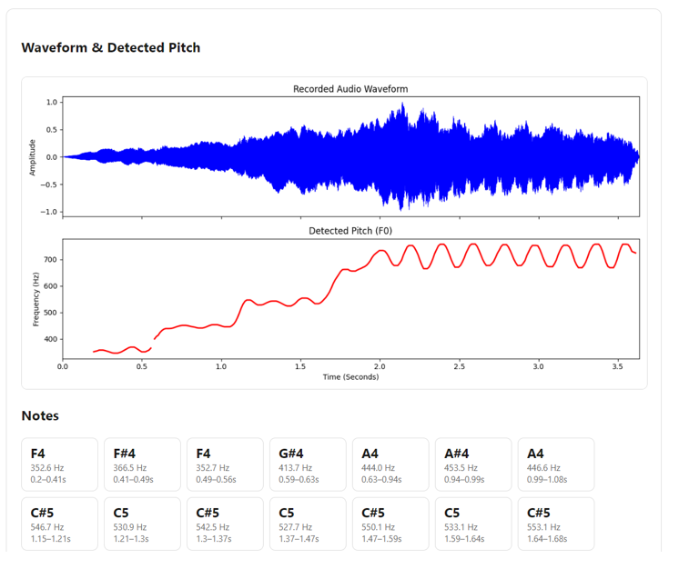

<div align="center">

# YIN Pitch Detection

**Accurate. Fast. From scratch.**

A production-grade Python implementation of the YIN fundamental frequency estimator with a novel confidence-gated octave correction system.

[](https://www.python.org/downloads/)
[]()
[]()
[]()
[]()

*Based on de Cheveigné & Kawahara (2002), JASA 111(4), 1917–1930*

</div>

---

## What It Does

Takes an audio signal → outputs a frame-by-frame pitch contour (Hz), with unvoiced frames marked as silent.

```
Input:  Raw audio (WAV, FLAC, OGG)
Output: [261.6, 261.8, None, 262.1, None, 329.4, ...]
              C4      C4   silence  C4   silence  E4
```

Works out of the box on **speech, singing, and musical instruments** — no training data, no GPU, no model files.

---

## Why This Implementation

The original YIN paper is clear about the algorithm but leaves two problems unsolved:

| Problem | Paper's Approach | This Implementation |
|---|---|---|
| Octave errors when harmonics dominate the fundamental | "First minimum below threshold" heuristic — reduces but doesn't eliminate errors | **Confidence-gated octave correction** using CMNDF as a signal quality metric |
| No way to evaluate or tune behavior | No reference implementation provided | **42 unit tests + cross-validation** against librosa pYIN with quantitative metrics |

---

## How It Works

```
┌─────────────────────────────────────────────────────┐
│                  Audio Frame                         │
└──────────────────────┬──────────────────────────────┘
                       ▼
              ┌─────────────────┐
              │  RMS Energy Gate │──── below 0.05 ───→ None (unvoiced)
              └────────┬────────┘
                       ▼
         ┌───────────────────────────┐
         │   Difference Function      │
         │   FFT-based autocorrelation│
         │   O(W log W) per frame     │
         └─────────────┬─────────────┘
                       ▼
         ┌───────────────────────────┐
         │   CMNDF Normalization     │
         │   Removes autocorrelation  │
         │   monotonic bias           │
         └─────────────┬─────────────┘
                       ▼
         ┌───────────────────────────┐
         │   First Dip Below         │
         │   Threshold               │
         └─────────────┬─────────────┘
                       ▼
         ┌───────────────────────────┐
         │   Octave Correction        │
         │                            │
         │   CMNDF < 0.01             │
         │     → no correction        │
         │   CMNDF 0.01–0.15          │
         │     → upward only          │
         │   CMNDF > 0.15             │
         │     → bidirectional        │
         │       (5× down, 2× up)     │
         └─────────────┬─────────────┘
                       ▼
         ┌───────────────────────────┐
         │   Parabolic Interpolation  │
         │   Sub-sample precision     │
         └─────────────┬─────────────┘
                       ▼
              f₀ = fs / τ
```

---

## Results

Evaluated on the **PTDB-TUG speech corpus** and real musical instrument recordings (ukulele, guitar) against `librosa.pyin`:

<div align="center">

| Metric | This Implementation | pYIN (librosa) |
|:---:|:---:|:---:|
| **Gross Pitch Error** | **0%** | 0% |
| **Fine Pitch Error** | **3.9¢** | 2.1¢ |
| **Note Accuracy** | **100%** | 100% |
| **Frames/second** | **38–202× faster** | baseline |

</div>

> pYIN achieves slightly lower FPE due to its HMM-based voicing model. This implementation trades that marginal accuracy gain for **two orders of magnitude faster** inference with zero dependencies beyond NumPy/SciPy.

---

## Quick Start

### Install

```bash
pip install numpy scipy soundfile matplotlib
```

### Detect Pitch

```python
from yin import pitchDetect
import soundfile as sf
import numpy as np

audio, fs = sf.read("recording.wav")
audio = audio / np.max(np.abs(audio))

contour = pitchDetect(
    audio, fs,
    min_f0=50,
    max_f0=1500,
    W=1024,
    decimation_factor=1,
    cmndf_threshold=0.15,
    rms_threshold=0.05,
)

# contour: numpy array of Hz values, NaN for unvoiced frames
for i, f in enumerate(contour):
    if f is not None and np.isfinite(f):
        print(f"Frame {i}: {f:.1f} Hz")
```

### Web Interface (Django)

```bash
python manage.py runserver
# → http://127.0.0.1:8000
```

Upload a WAV file or record directly from your browser's microphone. All algorithm parameters are tunable from the UI.

---

## Parameters

| Parameter | Default | Paper | Effect |
|---|:---:|:---:|---|
| `W` | 1024 | ≥ 2 × longest period | Window size. Bigger = better low-freq detection, worse time resolution. |
| `cmndf_threshold` | 0.15 | 0.10–0.15 | Dip quality threshold. Lower = fewer but cleaner detections. |
| `rms_threshold` | 0.05 | — | Frame energy floor. Frames below this are unvoiced. |
| `min_f0` / `max_f0` | 50 / 1500 | Match your domain | Narrower range = faster + fewer false detections. |
| `decimation_factor` | 1 | — | Downsample for speed. `2` ≈ 2× faster with no accuracy loss above 1500 Hz. |

---

## Octave Correction — The Key Extension

The original YIN algorithm picks the **first** CMNDF dip below threshold, which biases toward the fundamental. But when a harmonic is significantly stronger than the fundamental (common in guitar, piano, plucked strings), the algorithm locks onto the harmonic instead.

Adding naive bidirectional correction creates a new problem: confident fundamental detections get falsely shifted down an octave (e.g., C4 → C3).

**This implementation resolves both with a confidence gate:**

```
CMNDF value at detected dip
        │
        ▼
   < 0.01 ──── Very confident → no correction (trust it)
        │
   0.01–0.15  Confident → upward correction only
        │
   > 0.15 ──── Uncertain → full bidirectional
                    │
                    ├── Downward: doubled lag, must be 5× deeper
                    └── Upward:   halved lag, must be 2× deeper
```

The 5× downward ratio is intentionally strict — a false octave-down error is worse than a missed octave-up correction.

---

## Testing

```bash
python -m pytest unit_tests.py -v
```

**42 tests, 100% pass rate**, covering:

- Pure sine waves at known frequencies
- Signals with strong 2nd/3rd harmonics
- Octave ambiguity resolution
- Noise robustness (SNR 0–40 dB)
- Edge cases (very low/high frequency, silence, single-cycle signals)
- Boundary conditions (short frames, DC offset, clipping)

---

## Project Structure

```
├── yin.py                 # Core algorithm
│   ├── difference_vectorized()    # FFT-based difference function
│   ├── computeCmndf()             # Cumulative mean normalization
│   ├── find_first_local_min...()  # Threshold-based dip selection
│   ├── parabolic_interp()         # Sub-sample accuracy
│   ├── octave_correct()           # Confidence-gated correction
│   └── pitchDetect()              # Main entry point
│
├── views.py               # Django web view
│   ├── hz_to_note()              # Hz → musical note conversion
│   ├── get_notes()               # Frame grouping into note events
│   ├── smooth_contour()          # NaN-aware median filter
│   └── make_plot()               # Waveform + pitch visualization
│
├── unit_tests.py          # 42 unit tests
├── detector/              # Django templates
│   ├── index.html                # Full page (file upload)
│   └── _results.html             # AJAX partial (mic recording)
│
└── generate_report.py     # PDF test report generator
```

---

## Reference

> de Cheveigné, A., & Kawahara, H. (2002). YIN, a fundamental frequency estimator for speech and music. *The Journal of the Acoustical Society of America*, 111(4), 1917–1930.

---

<div align="center">

**MIT License**

</div>
```

---

## EXAMPLE OUTPUTS 
